# Plugin Discover-Connection
## The Connection Discovery Engine for Circles Network

Discover-Connection is the plugin for AI agent for expanding the Circles network through intelligent connection discovery and trust-based introductions. It bridges the gap between passionate individuals and helps newcomers find their initial trust connections needed to join the network.

## 🌟 Vision: Expanding Circles Through Meaningful Connections

Discover-Connection transforms how people join and grow within the Circles network by:

- **Connecting Passionate Builders**: Matches individuals based on shared passions, complementary skills, and collaborative goals
- **Facilitating Network Entry**: Helps newcomers find trusted members who can invite them to the Circles network
- **Building Trust-Based Communities**: Creates authentic connections that lead to natural trust relationships
- **Scaling Decentralized Onboarding**: Automates the discovery of ideal trust connections without central gatekeeping

## 🚀 Key Features

### Smart Connection Discovery
- **AI-Powered Matching**: Uses advanced reasoning to find truly compatible connections
- **Passion-Based Alignment**: Matches users on shared interests, complementary skills, and mutual goals
- **Vector-Based Search**: Leverages similarity search across comprehensive user profiles
- **Compatibility Scoring**: Evaluates mutual benefit potential between potential matches

### Circles Network Integration
- **Seamless Network Entry**: Guides newcomers through verification and trust-building process
- **Trust Connection Discovery**: Helps unverified users find existing members who might trust them
- **Member Onboarding**: Streamlines the path from discovery to verified network membership
- **Dual-Track Support**: Serves both existing members and newcomers differently

### Intelligent State Management
- **Dynamic User Journey**: Adapts conversation flow based on user's current network status
- **Multi-Stage Verification**: Collects Metri accounts and social proof for trust-building
- **Context-Aware Messaging**: Uses different introduction templates for members vs. newcomers
- **Automated Status Tracking**: Monitors user progress through verification and onboarding

## 🔄 Complete User Journey

### For Network Newcomers (Seeking Initial Trust)

```
Discovery → Onboarding → Matching → Verification → Trust Introduction → Network Entry
```

1. **Passion Discovery**: AI conversation to understand user's work, goals, and challenges
2. **Profile Building**: Creates comprehensive persona
3. **Connection Matching**: Finds compatible existing network members
4. **Circles Verification**: Collects Metri account and social proof for trust assessment
5. **Trust-Based Introduction**: Introduces to existing members with verification context
6. **Network Invitation**: Facilitates trust connections needed for Circles verification

### For Existing Members (Expanding Connections)

```
Discovery → Onboarding → Matching → Direct Introduction → Connection Building
```

1. **Connection Preferences**: Understands what new connections would help their work
2. **Profile Enhancement**: Updates persona with current goals and collaboration needs
3. **Member Matching**: Finds other members or newcomers aligned with their interests
4. **Direct Introduction**: Standard introductions without verification requirements
5. **Collaborative Growth**: Facilitates ongoing professional and creative partnerships

## 🛠 Technical Architecture

### State Management & User Journey Flow

The plugin implements comprehensive state management tracking users through different journey stages based on their Circles group membership status and connection discovery outcomes.

#### Core State Entities

##### Match Records (`matches` table)
Tracks discovered connections between users with the following status progression:

- **`match_found`**: Initial compatibility discovered between two users
- **`group_onboarding`**: Non-member matched with member, needs to join Circles group first  
- **`group_joined`**: User successfully joined Circles group via trust transaction
- **`ready_for_introduction`**: Both users are verified group members, ready for introduction
- **`introduction_outgoing`**: Introduction proposal sent to matched user
- **`introduction_incoming`**: User received introduction proposal from their match
- **`introduction_accepted`**: Both parties agreed to be introduced
- **`introduction_completed`**: Introduction successfully facilitated

##### Invitation Records (`invitations` table)  
Tracks users invited to join the group when no matches are found:

- **`invitation_sent`**: Non-member invited to join group due to no available matches
- **`invitation_completed`**: User successfully joined group following invitation

#### Complete User Journey Flows

##### Flow 1: Existing Group Member Seeking Connections

```mermaid
graph TD
    A[User Requests Connection] --> B[Check Group Membership]
    B --> C[Member: ✓]
    C --> D[Search for Matches]
    D --> E{Matches Found?}
    E -->|Yes| F[Create Match Record]
    F --> G[Status: ready_for_introduction]
    G --> H[Send Introduction Proposal]
    H --> I[Status: introduction_outgoing]
    I --> J{Other User Accepts?}
    J -->|Yes| K[Status: introduction_accepted]
    K --> L[Facilitate Introduction]
    L --> M[Status: introduction_completed]
    E -->|No| N[Send: Keep checking message]
```



##### Flow 2: Non-Member with Available Matches


##### Flow 3: Non-Member with No Available Matches (Invitation Flow)


#### State Validation Logic

##### CIRCLES_TRUST Action Validation
The trust action validates when a user provides a wallet address AND meets one of these conditions:

```typescript
// Check for group_onboarding match (user has match but needs group membership)
const hasGroupOnboardingMatch = matches.some(match => 
  (match.user1Id === userId || match.user2Id === userId) && 
  match.status === 'group_onboarding'
);

// Check for active invitation (user invited due to no matches)
const hasActiveInvitation = invitations.some(invitation =>
  invitation.invitedUserId === userId && 
  invitation.status === 'invitation_sent' &&
  invitation.type === 'circles_invitation'
);

return hasWalletAddress && (hasGroupOnboardingMatch || hasActiveInvitation);
```

##### INTRO_PROPOSAL Action Validation  
Introduction proposals validate for matches in specific states:

```typescript
const validStatuses = [
  'ready_for_introduction',  // Both users are group members
  'group_joined'             // User just joined, ready for intro
];

return matches.some(match => 
  (match.user1Id === userId || match.user2Id === userId) &&
  validStatuses.includes(match.status)
);
```

#### Error Handling & Edge Cases

##### Duplicate Match Prevention
- System checks existing matches before creating new ones
- Prevents multiple match records between same user pairs
- Maintains referential integrity across state transitions

##### Trust Status Verification  
- All matches filtered to only include verified group members
- Non-trusted users cannot be matched with existing members
- Trust status checked at multiple validation points

##### Invitation Cleanup
- Completed invitations marked with timestamps
- Prevents duplicate invitations to same user
- Invitation status updated after successful group joining

#### Database Schema Integration

```sql
-- Match records with status tracking
CREATE TABLE matches (
  id UUID PRIMARY KEY,
  user1_id UUID NOT NULL,
  user2_id UUID NOT NULL, 
  status VARCHAR(50) NOT NULL,
  compatibility_score INTEGER,
  created_at TIMESTAMP,
  UNIQUE(user1_id, user2_id)
);

-- Invitation tracking for no-match scenarios  
CREATE TABLE invitations (
  id UUID PRIMARY KEY,
  invited_user_id UUID NOT NULL,
  invitation_reason VARCHAR(50),
  status VARCHAR(50) NOT NULL,
  created_at TIMESTAMP,
  completed_at TIMESTAMP
);

-- User group membership tracking
CREATE TABLE user_trust_status (
  id UUID PRIMARY KEY,
  user_id UUID UNIQUE NOT NULL,
  wallet_address VARCHAR(42),
  trust_transaction_hash VARCHAR(66),
  circles_group_ca VARCHAR(42),
  created_at TIMESTAMP
);
```

This state management system ensures reliable user journey tracking while handling complex scenarios like duplicate prevention, trust verification, and seamless transitions between different user types and connection outcomes.

### Core Components

#### Actions
- **FIND_MATCH**: Main matchmaking and introduction flow
- **INTRO_PROPOSAL**: Sends introduction proposals to potential matches
- **CIRCLES_TRUST**: Handles trust connection acceptance and group joining

#### Providers
- **ONBOARDING**: Guides connection discovery conversation flow
- **PERSONA_MEMORY**: Formats user background using PEACOCK framework
- **CONNECTION_MEMORY**: Formats connection preferences and goals  
- **CIRCLES_VERIFICATION**: Provides verification guidance and context

#### Evaluators
- **DISCOVER-CONNECTION_REFLECTION**: Extracts insights from conversations
- **CIRCLES_VERIFICATION_EVALUATOR**: Processes verification responses automatically

#### Services
- **UserTrustStatusService**: Manages user group membership and trust status
- **ProposalQuotaService**: Manages introduction request limits

## 🎯 Use Cases & Impact

### Primary Use Cases

1. **Network Expansion**: Help Circles network grow by connecting newcomers with potential trust connections
2. **Talent Discovery**: Connect builders, creators, and innovators across the network
3. **Collaborative Matching**: Find partners for projects, startups, and creative endeavors
4. **Community Building**: Foster relationships that strengthen the overall network
5. **Onboarding Automation**: Reduce friction for newcomers seeking network entry

### Real-World Scenarios

- **Tech Founders**: Connecting early-stage founders with experienced builders and potential co-founders
- **Creative Collaborators**: Matching artists, writers, and designers for joint projects
- **Research Partnerships**: Linking academics and researchers with complementary expertise
- **Skill Exchange**: Connecting individuals for mentoring and knowledge sharing
- **Geographic Bridges**: Helping remote individuals find local community connections

## 🔧 Integration Examples

### Basic Plugin Integration

```typescript
import { discoverConnectionPlugin } from '@elizaos/plugin-discover-connection';

const agent = {
  name: 'ConnectionAgent',
  plugins: [discoverConnectionPlugin],
  // ... other config
};
```

### Custom Configuration

```typescript
const customAgent = {
  name: 'CirclesExpansionAgent',
  plugins: [discoverConnectionPlugin],
  settings: {
    // Enable quota limits for fair usage
    enableQuotaLimits: true,
    // Customize verification requirements
    requireSocialProof: true,
    // Set introduction batch limits
    maxDailyIntroductions: 5,
  }
};
```

## 🗄 Database Schema

### Core Tables

- **`persona_*`**: PEACOCK framework dimensions (demographic, characteristic, routine, goal, experience, relationship, emotionalState)
- **`connection_*`**: Connection preferences (desired_demographic, desired_dynamic, desired_activity, desired_availability, desired_value_exchange, desired_relationship_type, desired_vibe)
- **`persona_contexts`**: Generated user profile summaries
- **`connection_contexts`**: Generated ideal match descriptions
- **`matches`**: Match records with compatibility scores and status tracking
- **`introductions`**: Introduction proposals and responses
- **`circles_verification`**: User verification data (Metri accounts, social links)
- **`user_trust_status`**: Group membership and trust status tracking
- **`proposal_quota`**: Introduction request quotas and usage tracking

## 📦 Installation & Setup

### Install the Plugin

```bash
npm install @elizaos/plugin-discover-connection
```

### Basic Configuration

```typescript
import { discoverConnectionPlugin } from '@elizaos/plugin-discover-connection';

const agent = {
  name: 'CirclesConnectionAgent',
  plugins: [discoverConnectionPlugin],
  // ... other config
};
```

### Environment Requirements

```bash
# Core AI Model (required)
OPENAI_API_KEY=your_openai_key
# or
ANTHROPIC_API_KEY=your_anthropic_key

# Database (defaults to PGLite if not specified)
POSTGRES_URL=your_postgres_connection_string
```

## 🚀 Getting Started

### For Circles Network Operators

1. **Deploy the Agent**: Set up with your preferred ElizaOS configuration
2. **Configure Database**: Ensure SQL database connectivity for user data
3. **Set Quotas**: Configure introduction limits to manage network growth
4. **Monitor Growth**: Track new connections and network expansion metrics

### For Community Builders

1. **Integrate Plugin**: Add to existing ElizaOS agent setup
2. **Customize Templates**: Modify prompt templates for your community's tone
3. **Set Verification**: Configure what social proof is required for newcomers
4. **Launch Community**: Start connecting passionate individuals in your domain

## 🔍 Key Differentiators

### vs Traditional Networking Tools
- **AI-Powered Matching**: Deep compatibility analysis vs. simple filters
- **Trust-Based Growth**: Focuses on meaningful connections, not volume
- **Context-Aware**: Understands user journey stage and adapts accordingly
- **Automated Onboarding**: Reduces manual work in community growth

### vs Other Connection Plugins
- **Circles-Native**: Purpose-built for decentralized trust networks
- **Dual-Track Support**: Serves both members and newcomers simultaneously  
- **State Management**: Sophisticated user journey tracking
- **Verification Integration**: Built-in support for identity verification

## 🎯 Success Metrics

### Network Growth Indicators
- **New Member Acquisition**: Tracking successful trust connections leading to verification
- **Connection Quality**: Measuring ongoing engagement between introduced users  
- **Time to Trust**: Average time from discovery to successful network entry
- **Retention Rate**: Percentage of newcomers who remain active after joining

### Community Health Metrics
- **Match Success Rate**: Percentage of introductions leading to ongoing connections
- **Geographic Distribution**: Tracking global reach and local cluster formation
- **Skill Diversity**: Monitoring variety of expertise within the network
- **Collaboration Outcomes**: Projects and partnerships formed through connections

## 🔄 Advanced Usage

### Custom Matching Logic

```typescript
// Override compatibility analysis
const customPlugin = {
  ...discoverConnectionPlugin,
  providers: [
    ...discoverConnectionPlugin.providers,
    customCompatibilityProvider
  ]
};
```

### Integration with External APIs

```typescript
// Add external verification services
const enhancedPlugin = {
  ...discoverConnectionPlugin,
  services: [
    ...discoverConnectionPlugin.services,
    githubVerificationService,
    linkedinProfileService
  ]
};
```

## 🛠 Dependencies & Architecture

### Core Dependencies
- **@elizaos/core**: Foundation runtime and agent framework
- **@elizaos/plugin-sql**: Database operations and SQL adapters  
- **@elizaos/api-client**: API communication and external integrations
- **viem**: Blockchain interactions for Circles network operations
- **bun**: Runtime and package management

### Database Requirements
- **SQL Database**: PostgreSQL (production) or PGLite (development)
- **Vector Support**: For similarity search in user matching
- **Transaction Support**: For atomic state transitions during onboarding

### External Integrations
- **Circles Network**: Integration with Circles protocol and trust graph
- **Metri Identity**: Identity verification through Metri accounts
- **Social Platforms**: Verification via GitHub, Twitter/X, personal websites
---

**Discover-Connection** is more than just a plugin—it's the foundation for meaningful, trust-based community growth in the decentralized web. By intelligently connecting passionate individuals and facilitating their entry into established networks, we're building the social infrastructure for tomorrow's digital communities.
